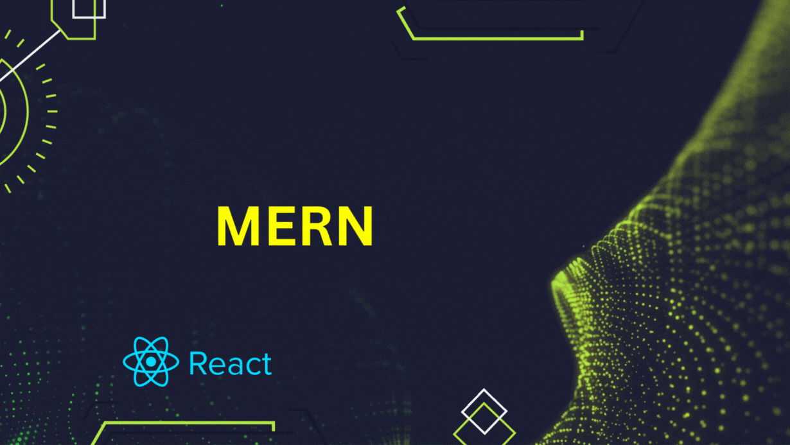

  

# 👋 Hello, I'm Saifur Rahman!

### Aspiring MERN Developer ✨

Greetings, fellow coder! I'm a fresh face in the coding universe, currently immersed in the enchanting <strong>MERN</strong> stack. On a quest to craft clean, efficient solutions. Seeking opportunities to contribute to innovative projects and turn my thoughts into reality.

# 🚀 My Projects

## 1. Edugram

🌐 **Live Site:** [Edugram Live](https://splendorous-kheer-a4858e.netlify.app)  
🔗 **GitHub Repositories:**
- [Client](https://github.com/sifurr/edugram-client.git)
- [Server](https://github.com/sifurr/edugram-server.git)

**Edugram** is a fullstack web application designed to explore the LMS. It seamlessly integrates frontend and backend technologies, ensuring a secure payment process through Stripe. The platform boasts a responsive design with a customizable dark mode and supports role-based authentication for students, teachers, and admins. Teachers can easily apply for roles, create and manage courses, assignments, and receive valuable feedback from students. Edugram leverages technologies such as React, Node.js, MongoDB, and Firebase for a dynamic and engaging user experience. 

## 2. Sharing Surplus Food

🌐 **Live Site:** [Sharing Surplus Food Live](https://lucent-dieffenbachia-e50d23.netlify.app)  
🔗 **GitHub Repositories:**
- [Client](https://github.com/sifurr/sharing-surplus-food-client.git)
- [Server](https://github.com/sifurr/sharing-surplus-food-server.git)

**Sharing Surplus Food** is a community-driven platform addressing food surplus and scarcity. Users can contribute surplus food through the frontend and request available items. The platform ensures secure interactions with authentication and authorization implemented using JWT. Key features include dynamic data fetching with Tanstack Query, Firebase authentication for user creation, and an engaging user interface with Flowbite and Tanstack-react-table. Users have control over managing their listed foods, and the responsive design ensures accessibility across devices. Additional enhancements include dynamic page title display and a smooth page scrolling progress animation with Framer Motion.

## 3. Brand Shop

🌐 **Live Site:** [Brand Shop Live](https://brandshop-assignment-10-62b49.web.app)  
🔗 **GitHub Repositories:**
- [Client](https://github.com/sifurr/brandshop-client.git)
- [Server](https://github.com/sifurr/brandshop-server.git)

**Brand Shop** is an innovative platform designed for a seamless shopping experience. The frontend, built with email and password-based authentication and authorization using Firebase, offers secure user interactions. Additional features include social login with Google, user-friendly interfaces for product management, dynamic image population for sliders, and MongoDB for efficient data storage. The site is fully responsive across mobile, tablet, and desktop devices, with a Dark/Light mode toggler enhancing the user experience.

## 🌐 Reach Me Out

- 📧 **Email:** [tosaifurrahman@gmail.com](mailto:tosaifurrahman@gmail.com)
- 🌐 **LinkedIn:** [linkedin.com/in/mr-saifur-rahman](https://www.linkedin.com/in/mr-saifur-rahman)

## 📊 Current Stats

## 💻 Technologies that I Know

- **Frontend:** HTML, CSS, JavaScript (React)
- **Backend:** Node.js, Express.js
- **Database:** MongoDB

## 🚀 Current Overview

    
    

 

    
    

